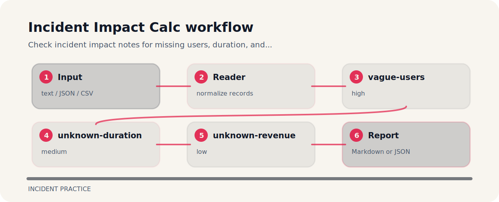

# Incident Impact Calc


This repository turns a tiny plain text into reviewable signals for incident response.

## Signals

| Signal | Level | What it flags | Fix direction |
| --- | --- | --- | --- |
| `vague-users` | high | affected users are vague | Estimate affected user or tenant count. |
| `unknown-duration` | medium | incident duration is missing | Record detection, mitigation, and recovery timestamps. |
| `unknown-revenue` | low | revenue impact is missing | Estimate or explicitly mark not applicable. |

## Tiny fixture

```text
risky: impact many users duration unknown revenue unknown severity high
clean: impact 420 users duration 37m revenue_estimate 1200 severity high
```

## Try the fixture

```bash
git clone https://github.com/mertefekurt/incident-impact-calc.git
cd incident-impact-calc
python -m pip install -e ".[dev]"
incident-impact-calc examples/sample.txt
```

## Finding map


